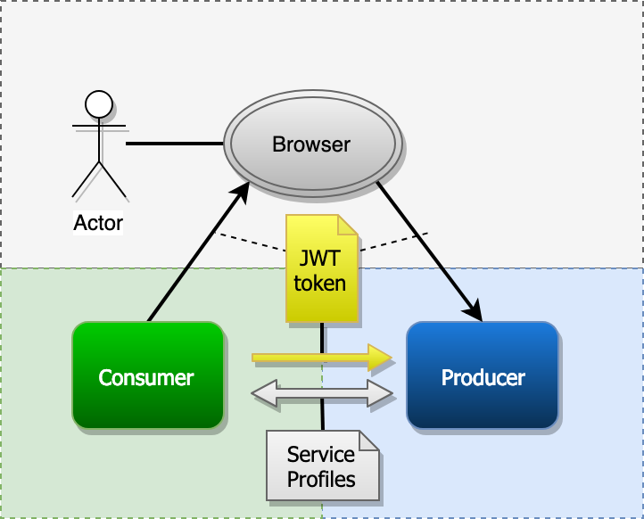
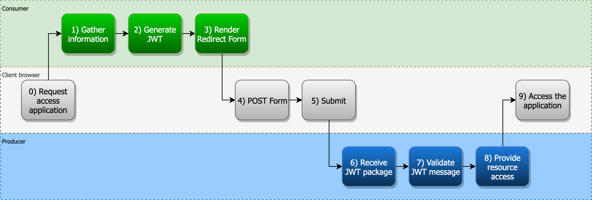
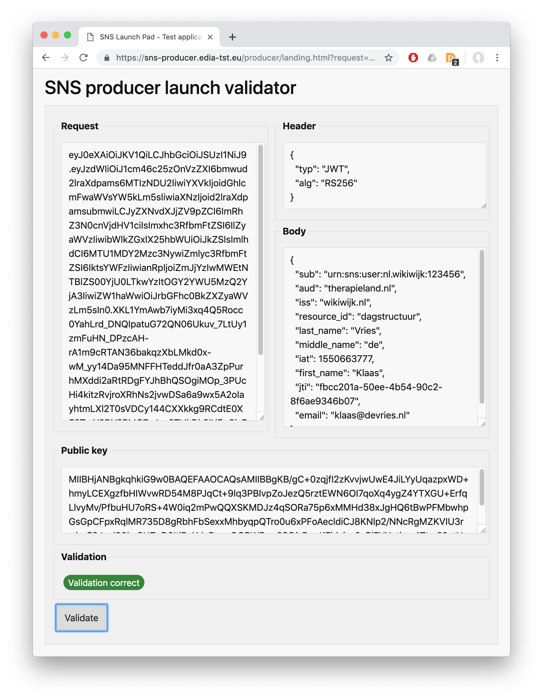
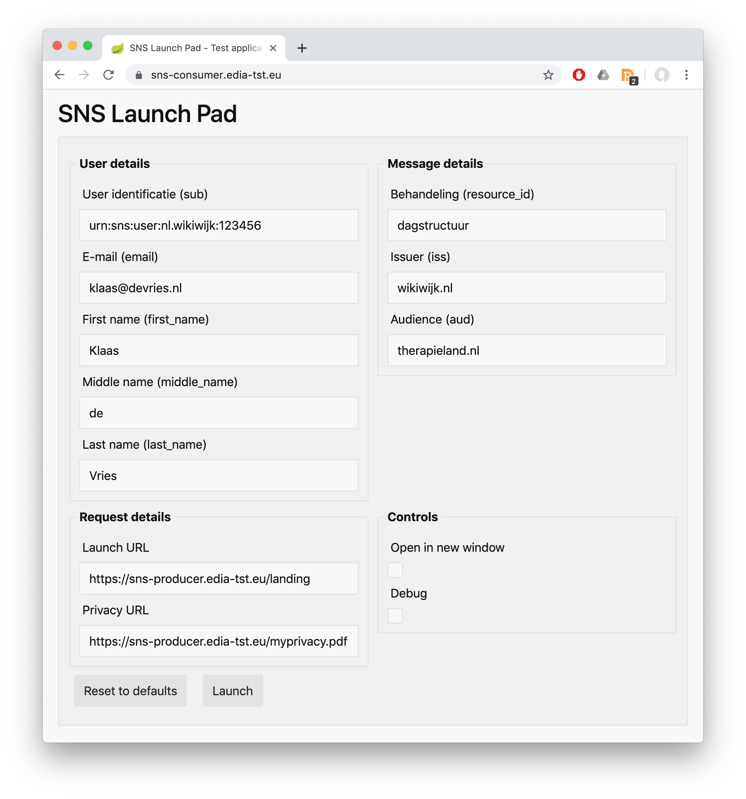

# SNS Launch protocol technical specification

# Architecture

The SNS launch protocol enables portal applications to integrate external applications like tools, games and treatments seamlessly into their platform. The SNS launch protocol connects applications like tools, games and treatment to a portal like environment. The portal, or consumer in this context, is the system that has an active session with an authenticated user in the system. The consumer prepares a launch by creating a JWT token that contains all the launch details needed for the producer to function properly. The producer in this context is the application that delivers functionality to the user in the portal, either in the context of the portal as an iframe, or in its own context. The producer of the launch receives the JWT token and unpacks the information in the token to identify the user and the target treatment and launches a new session for the user.

As an extension to the basic version of the protocol as described above, the producer and consumer are able to communicate directly within the session of the user in order to exchange additional information or register progress and outcomes. The concept of these services are service profiles, each consumer and producer can implement and agree on the usage of various profiles that extend the basic usage. 



## Concepts
* **Consumer**, the portal like service that links to the producer, that is, an application like a tool, a game, or a treatment.
* **Producer**, the service that delivers an application like a tool, a game, or a treatment to the portal.
* **JWT token**, a package exchanged between consumer and producer that contains the relevant launch information.

## Rationale
The SNS Launch protocol is highly inspired by the Learner Tool Interoperability (LTI) which has had a tremendous impact on the relation between learner management systems and tool providers. LTI has simplified the integration of external tools into learner management systems, the whole landscape of tool providers has emerged. The key concepts the LTI being successful has been:
* In the core the LTI standard is simple and clear.
* The LTI standard in its basic form is easy to integrate because it makes use of existing technologies and standards.
* The core standard can be extended by profiles; within LTI there are profiles for reading roster information and writing results.

The SNS launch standard applies these concepts when it comes to defining a successful launch protocol. The key differences are:

* Use of more modern technologies like JWT instead of OAuth 1.x.
* The alignment of user identity with a still to be specified SSO standard.
* More restrictions on security and the JWT validity.

The SNS Launch protocol has the following goals.

### Ease of software implementation
The protocol should be easy to implement, hours instead of days, and days instead of weeks. It does so by standing on the back of giants; that is make use of existing technologies and standards.

### Ease of use and configuration
The protocol should be easy to configure from both the producer and consumers' side. In the essence, an exchange of endpoint URL and public key pair should be sufficient.

### Scalable, decentral, and point to point
The architecture should not rely on external or central services and should be point-to-point in the sense that parties should be able to connect without relying on other parties and scale infinitely.

### Secure
The protocol should mitigate against most common attacks by aligning to pre-existing proven technologies like JWT.

### Privacy
The protocol should support anonymous identities and be reluctant to disseminate personal information.

# Implementation guide

This guide describes how to implement the SNS Launch protocol. The protocol consists of:
* The communication protocol, how the interaction of the SNS Launch protocol looks like.
* The JWT message and the related payload.
* The SNS Launch protocol security restrictions.

## Communication protocol
The core procedure of the launch looks as follows:

1. The client requests access to a (remote) application in the portal environment.
2. The consumer produces the information needed for the JWT, including: 
    1.	User identity
    2.	Intended resource identifier.
    3.	The JTW private and public key.
3.	The consumer generates the JWT token based on the information above, described in more detail in the [JWT message format section](#jwt-message-format).
4.	The consumer redirects the user to a html5 page with a form, which contains: 
    1.	The JWT token in a hidden field with name `request`.
    2.	The form method is **POST**.
    3.	The action of the producers endpoint.
5.	The client browser posts the redirect form (triggered by JavaScript).
6.	The producer receives the post at the endpoint and unpacks the JWT token.
7.	From the JWT token, it unpacks the fields and verifies the following: 
    1.	The identity of the producer (aud).
    2.	The identity of the consumer (iss).
    3.	Based on the identity of the consumer (iss), the signature of the issuer JWT. 


 
The form-post-redirect message
In step 5) in the communication protocol, the user is redirected to the producer with the JWT message using a post form. The form needs to:
* Forward the JWT token in the request field of a form.
* The page needs to request consent to the user and inform the user about the information being shared.

Appendix D contains a reference implementation of such a page.

## JWT message format
The message makes use of the [JSON Web Token (JWT) standard](https://jwt.io/). Implementations in various languages are widely available. The concept of a JWT token is it consists of a header containing metadata of the token, a body or payload that consists of a set of required fields, and a signature that should be validated.

The JWT message consists out of the following fields, the fields with an asterix (*) are required.

| Description | Field | Value |
| - | - | - |
| User identity* | sub | User unique identification, see format for details. |
| User email | email | User email |
| First name | given_name | User first name |
| Middle name | middle_name | User middle name |
| Last name | family_name | User last name |
| Subject* | resource_id | Identification of the target treatment |
| Issuer* | iss | URL base of the the consumer (aka the sending party) |
| Audience* | aud | URL base of the producer (aka the receiving party). |
| Unique message id* | jti | UUID or anything else that makes the message unique |
| Issue time | iat | Timestamp from the time of creation |
| Expiration time* | exp | Timestamp for the expiration time |
| Public / Private key* | -  | Signing private key, public key for validation. |

### User identifier format
The format for the user identity is an urn. This identifier is prefixed urn:sns:user, subsequently the reverse domain of the identity platform and finally the user identity. The format is as follows:

```json
urn:sns:user:<domain>:<user>
```

For example:

```json
urn:sns:user:nl.issuer:123456
```

## Security restrictions
* The JWT must use an async public / private key to sign the JWT tokens. The public key should be made available to the producer, the private key should remain private on the consumers infrastructure. The use of shared secrets is not allowed, because the issuer of the JWT cannot guarantee ownership as the key is shared.
    * All algorithms starting with HS should NOT be used, that is HS256, HS384, HS512
    * The following algorithms can be used by the consumer, the producer should support all algorithms:
        * RS256, recommended
        * RS384, optional
        * RS512, optional
        * ES256, recommended
        * ES384, optional
        * ES512, optional
* The expiration time (exp) on the message should be set to 5 minutes in order to prevent leaking JWT keys to be valid outside a timeframe.
* The unique message id (jti) should be verified as a nonce and should be based on a random or pseudo random number. If a UUID is used, it should be initialized with a random number. This approach mitigates replay attacks.
* Tokens must be transported over HTTPS from both consumer and producer sides.

### Example message

```json
{
  "alg": "RS256",
  "typ": "JWT"
}
{
  "sub": "urn:sns:user:nl.issuer:123456",
  "aud": "audience.nl",
  "iss": "issuer.nl",
  "resource_id": "paniek",
  "last_name": "Vries",
  "middle_name": "de",
  "exp": 1550663222,
  "iat": 1550662922,
  "first_name": "Klaas",
  "jti": "a5d155b2-d8b4-43bb-8730-1646ae35357c",
  "email": "klaas@devries.nl"
}
```

## Launch configuration requirements

### Producer configuration requirements
| Field | Remark | Scope |
| - | - | - |
| Application URL | The endpoint of the producer application. | Per application |
| Public / Private key | The public / private keys | Preferably per application |


**Note that SamenBeter expects links to open in a new tab.**

### Consumer configuration requirements
| Field | Remark | Scope |
| - | - | - |
| Consumer public key | The key to validate the consumer JWT message with. | Per consumer, based on the iss field value. |

# Appendix A, test keys and secrets
Test key and secret, please never use outside a test context.

## Public key
Type: RSA
Length: 2024

```
MIIBHjANBgkqhkiG9w0BAQEFAAOCAQsAMIIBBgKB/gC+0zqjfI2zKvvjwUwE4JiLYyUqazpxWD+hmyLCEXgzfbHIWvwRD54M8PJqCt+9Iq3PBIvpZoJezQ5rztEWN6OI7qoXq4ygZ4YTXGU+ErfqLlvyMv/PfbuHU7oRS+4W0iq2mPwQQXSKMDJz4qSORa75p6xMMHd38xJgHQ6tBwPFMbwhpGsGpCFpxRqlMR735D8gRbhFbSexxMhbyqpQTro0u6xPFoAecldiCJ8KNlp2/NNcRgMZKVIU3rwhp52JcnI90by8UZoD0ItlRoXdaBmmQORWRrm2SC1rRu+KFidzjxe2cRiFVXqthqe1Ttm29atUeVftJhEgb7UpxKJPAgMBAAE=
```

## Private Key
Type: RSA
Length: 2024

```
MIIEpwIBADANBgkqhkiG9w0BAQEFAASCBJEwggSNAgEAAoH+AL7TOqN8jbMq++PBTATgmItjJSprOnFYP6GbIsIReDN9scha/BEPngzw8moK370irc8Ei+lmgl7NDmvO0RY3o4juqherjKBnhhNcZT4St+ouW/Iy/899u4dTuhFL7hbSKraY/BBBdIowMnPipI5FrvmnrEwwd3fzEmAdDq0HA8UxvCGkawakIWnFGqUxHvfkPyBFuEVtJ7HEyFvKqlBOujS7rE8WgB5yV2IInwo2Wnb801xGAxkpUhTevCGnnYlycj3RvLxRmgPQi2VGhd1oGaZA5FZGubZILWtG74oWJ3OPF7ZxGIVVeq2Gp7VO2bb1q1R5V+0mESBvtSnEok8CAwEAAQKB/VO7cg6Mt8y3fsHIbqfxOV5oScWcOY/Erl8mKJFJgxns/JayvcpqtOpuy6AWV2ixj9y33QC0V15r0fkiTgLWtS5/sykhwFoeMunJ8C7VndfnMbdMA42zWRcfeRTf4YAoBlALPwePASklzu2ktJotH4MyvNrNpY5/nT+JYIgx/LxhIwk/HxJ6uVYiFpAINfAGfBphcgxzKWnV23WvRYtrIJc/XXLvSxK08tvoZfm4c4quf1i3LpTc+1mZmT+jefZoXQcWUnEbCk5Q/8gvDigHMbdOlTqT4/iNj/03PmueWsljiyhbXDYOVGJCaGQpeNaFnhilXPrYEBkAvXIOg6ECfw7l7td0wyPP0vCYFcbQEr3qng9vg2ISVas8gIOU/OeKNSJ9+wbKWcd0DAztxGShuqDZjBXj+RSEL1XrABjDpk9RqpgkBx3NNXEbCBnYg3+LU8HCtUBWi5amaJi8JH2839cVXjdZbPXBPmp5S93SKjmuoiBas8oKITh0yEwwdb8CfwzPAeg765BhD4AmwSzoQRy6Sfxf6R0Z8Uo9a2mxBiGSKPvX7zQMG384208FvTlaW3UoOAhSN6HsfBwWT9pzRIaWAkFP8CWxRiRqzg20FYzTweQZOnqje6YRYSocX64l22zhqV3Y3DdqevIiGpxDFqFM8QXeaAcchCvg6LpTl3ECfwqlC1RynwM1eLhjUhvti5aazjilKrCl/QQOhJx/lXwyaeitLvEZH7C9H+cU8+AbFmfbSJZTfyLDl7bB5B3NnUTLSyLNizAl8WtRLyaYZsx41m15G1xO+gm3+MA4nbIhg6YAJINTp+CoJFqbNDPX+EeimUCYziErv7TA7GRTs60Cfws28F+KnzzBjtXQmNCd5eymOwNKYovFXBt5XWOjyE96boHa1ahHdYfVm0c8KipeL7eLaEv42JbgvOXGr1IAHJ6OFxliSUxnQ5e9H/6ljzzHZ3s0j5wzKZ8EloNNZoTOxqk1h5oQtveaNl1seMoaf2TpPhq6WXDoidz1Ri9l4zECfmzg4k6Jo2YpZVAm1xQU5SPYDawH4DNlWeTMnqBEwfZap7wu79zJkZYdCaegzabb/FxFSu0+21djZbq4+PdtsxIqmg8pObu2s7z+BqC0iM5z01deygAfgP4NRzmQqvECiDmjKWxXZlzQNPxnlu3MJZMrfDXTSzDeIBph1YOIag==
```

# Appendix B, near future roadmap
Near future developments will consists of the following 

* Alignment with the still to be developed login and identity part of the SNS protocol, the impact probably will be that the JWT message will contain information about role. Another impact might be that the JWT message will get a higher exp date, matching something like a login session (30~60 minutes)
* Extension with profiles / services. The protocol will be extended to support communication between producer and consumer. This will be done by the consumer providing endpoints to the consumer at launch time.

# Appendix C, Test tools and validators

## Producer test tool
The SNS launch producers can test with the following tool:
[sns-consumer.edia-tst.eu](https://sns-consumer.edia-tst.eu/)
The tools allows to send a SNS Launch request to a given endpoint, and makes use of the test key and secret as provided in Appendix A.

### Explanation
This tool has been build by EDIA to easily test and mimic a launch.
Want to test it?
From the left side (User details), for example:

* Remove email or firstname
* Press launch on the bottom of the screen
    * You will get the consent screen.
        * Cancel - You are redirected back to the issuer
        * Agree - You are launched to the audience application.
        * Please note: for testing purposes we advise to test in incognito tab. If you select the option to NOT show the message again, just close and reopen incognito browser.



## Consumer test tool.
The tool consumer can use as endpoint the following:
[sns-producer.edia-tst.eu/validate.html](https://sns-producer.edia-tst.eu/validate.html)



# Appendix D, redirect page reference implementation

```html
<!doctype html>
<html lang="nl">
<head>
    <title>SNS - Bevestiging delen persoonsgegevens</title>
    <!-- Compiled and minified CSS, Replace with self hosted file in production. -->
    <link href="https://cdnjs.cloudflare.com/ajax/libs/materialize/1.0.0/css/materialize.min.css" rel="stylesheet">
    <link href="https://fonts.googleapis.com/icon?family=Material+Icons" rel="stylesheet">
    <!-- Compiled and minified JavaScript, Replace with self hosted file in production. -->
    <script src="https://cdnjs.cloudflare.com/ajax/libs/materialize/1.0.0/js/materialize.min.js"></script>

</head>
<body>
<form action="ACTION" id="form" method="post">
    <input name="request" type="hidden" value="JWT_TOKEN"/>
</form>
<div class="container" id="confirm" style="display: none">
    <h2>De volgende informatie wordt gedeeld met {aud}</h2>
    <table class="striped">
        <thead>
        <tr>
            <th style="width: 25%">Veld</th>
            <th style="width: 75%">Waarde</th>
        </tr>
        </thead>
        <tbody>
        <tr id="first_name">
            <td>Voornaam</td>
            <td>{first_name}</td>
        </tr>
        <tr id="last_name">
            <td>Achternaam</td>
            <td>{last_name}</td>
        </tr>
        <tr id="email">
            <td>E-mail</td>
            <td>{email}</td>
        </tr>
        </tbody>
    </table>
    <table>
        <tbody>
        <tr>
            <td style="width: 25%">Ik wil deze melding niet meer zien:</td>
            <td style="width: 75%">
                <!-- Switch -->
                <div class="switch" id="futureSuppress">
                    <label>
                        Nee <input type="checkbox"> <span class="lever"></span> Ja
                    </label>
                </div>
            </td>
        </tr>

        </tbody>
    </table>

    <div class="section">
        <button id="cancel" class="waves-effect waves-teal btn-flat">Annuleren<i class="material-icons right">cancel</i>
        </button>
        <button id="proceed" class="waves-effect waves-light btn">Akkoord <i class="material-icons right">send</i>
        </button>
    </div>
</div>
</body>
<script>
  var aud;
  /**
   * The parts of the JWT body that is considered to be personal info.
   */
  var userParts = ['first_name', 'last_name', 'email'];

  /**
   * Utility function that replaces {keys} in text nodes of a
   * element and its children.
   */
  var replaceInTextNodes = function (element, seach_and_replace) {
    var nodeValue = element.nodeValue;
    if (nodeValue) {
      for (var key in seach_and_replace) {
        if (seach_and_replace.hasOwnProperty(key)) {
          nodeValue = nodeValue.replace('{' + key + '}', seach_and_replace[key]);
        }
      }
      element.nodeValue = nodeValue;
    }
    for (var i in element.childNodes) {
      var child = element.childNodes[i];
      if (child) {
        replaceInTextNodes(child, seach_and_replace);
      }
    }
  };

  /**
   * Reads the jwt and returns the body part as object.
   */
  var readJwtToken = function (jwt) {
    var parts = jwt.split('.');
    return JSON.parse(atob(parts[1]))
  };

  /**
   * This function parses the JWT and looks for personal info.
   * If found, it will populate the form with the information and
   * the form will display.
   *
   * @returns {boolean} true if the JWT has personal info.
   */
  var parseAndReadJwt = function () {
    var request_el = document.getElementsByName('request');
    if (request_el.length > 0) {
      var value = request_el[0].getAttribute('value');
      var jwt = readJwtToken(value);
      var elements = {};
      for (var i in userParts) {
        if (jwt[userParts[i]]) {
          elements[userParts[i]] = jwt[userParts[i]];
        } else {
          document.getElementById(userParts[i]).style.display = 'none'
        }
      }
      // Set the top variable aud to the JWT audience.
      aud = jwt.aud;
      if (getSuppressCookie()) {
        return false;
      }

      if (Object.keys(elements)) {
        elements.aud = jwt.aud;
        var form = document.getElementById('confirm');
        replaceInTextNodes(form, elements);
        form.style.display = ''
      }
    }

    // Check if the JWT actually had personal info.
    return Object.keys(elements).length !== 0
  };

  /**
   * The cancel button function.
   */
  var cancel = function () {
    window.history.back();
  };
  /**
   * The proceed button function.
   */
  var proceed = function () {
    document.getElementById('form').submit();
  };

  var getCookieName = function () {
    var base64 = btoa(aud || "unk");
    base64 = base64.replace(/=+/g, '');
    return "sc_" + base64;
  };
  /**
   * Gets a suppress consent cookie
   */
  var getSuppressCookie = function () {
      // Generate the cookie name based on the base64 string of the domain.
      var name = getCookieName();
      // Read the cookie
      var decodedCookies = decodeURIComponent(document.cookie).split('; ');
      for (var i in decodedCookies) {
        var cookieValue = decodedCookies[i].split('=');
        var cookie = cookieValue[0];
        var value = cookieValue[1];
        if (cookie === name) {
          return value === 'true';
        }
      }
      return false;
    }
  ;

  /**
   * Add a suppress consent cookie, valid for one year and specific to the domain.
   */
  var addSuppressCookie = function () {
    // Generate the cookie name based on the base64 string of the domain.
    var name = getCookieName();
    var expiry = new Date();
    // Set expiry to a year
    expiry.setTime(expiry.getTime() + (356 * 24 * 60 * 60 * 1000));
    document.cookie = name + '=true;expires=' + expiry.toUTCString();
  };

  /**
   * Remove the suppress consent cookie.
   */
  var removeSuppressCookie = function () {
    // Generate the cookie name based on the base64 string of the domain.
    var name = getCookieName();
    var expiry = new Date();
    expiry.setTime(0);
    document.cookie = name + '=false;expires=' + expiry.toUTCString();
  };

  /**
   * Initializes the event listeners for this page.
   */
  var initListeners = function () {
    document.getElementById('futureSuppress').addEventListener('change', function (event) {
      if (event.target) {
        if (event.target.checked) {
          addSuppressCookie();
        } else {
          removeSuppressCookie();
        }
      }
    });
    document.getElementById('cancel').addEventListener('click', function () {
      cancel();
    });
    document.getElementById('proceed').addEventListener('click', function () {
      proceed();
    });
  };
  /**
   * The onload handler.
   */
  window.onload = function () {
    // Check if there is a need to render the form. There are two conditions
    // on which the form should not be rendered:
    // 1) There is no personal data in the cookie.
    // 2) The user has opted in for consent.
    if (parseAndReadJwt()) {
      initListeners();
    } else {
      document.forms[0].submit();
    }
  };
</script>
</html>
```

# Appendix E, SNS Launch protocol code examples.

There are several code examples in different programming language demonstrating how to
implement SNS Launch protocol:

language | GitHub repository
--- | ---
Java | [OpenSNS-BeterMetElkaar-SSOLaunchSamenBeter-Java](https://github.com/GidsOpenStandaarden/OpenSNS-BeterMetElkaar-SSOLaunchSamenBeter-Java)
Python | [OpenSNS-BeterMetElkaar-SSOLaunchSamenBeter-Python](https://github.com/GidsOpenStandaarden/OpenSNS-BeterMetElkaar-SSOLaunchSamenBeter-Python)
PHP | [OpenSNS-BeterMetElkaar-SSOLaunchSamenBeter-PHP](https://github.com/GidsOpenStandaarden/OpenSNS-BeterMetElkaar-SSOLaunchSamenBeter-PHP)
